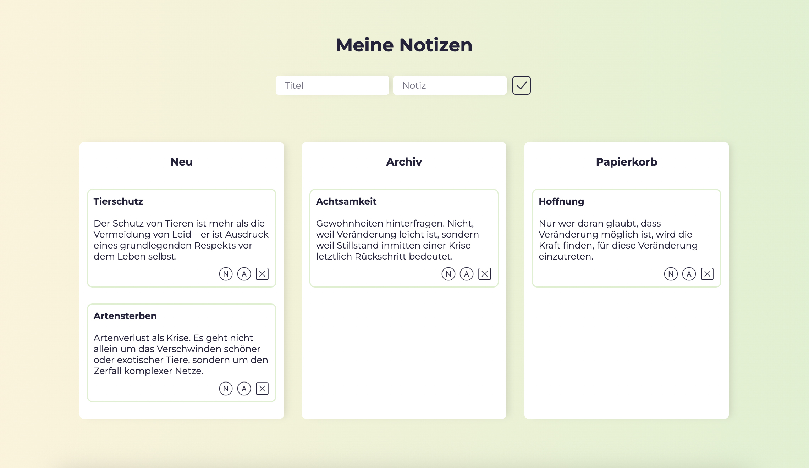

# Notizblock

Notizblock is a web-based notepad application that allows users to create, organize, and manage notes with different categories and priority levels. Notes can be added, edited, and deleted, while all data is stored locally using the browser's LocalStorage.

Notizblock is part of the Developer Akademie's training programme for software developers ([www.developerakademie.com](https://www.developerakademie.com)). Certain technical and logical requirements had to be met for this project, but I was able to create my own design and user experience.



## Table of Contents

- [Prerequisites](#prerequisites)
- [Quickstart](#quickstart)
- [Project Structure](#project-structure)

## Prerequisites

No build tools or server setup required — just a modern web browser.

## Quickstart

Clone the repository:

```bash
git clone https://github.com/karinaklages/notizblock.git
cd notizblock
```

Then open `index.html` directly in your browser:

```text
notizblock/index.html
```

## Project Structure

```text
notizblock/

├── assets/
│   ├── fonts/           # Local font files
│   ├── icons/           # Application icons
│   ├── img/             # Images and screenshots
│   ├── scripts/
│   │   └── templates.js # HTML templates
│   └── styles/
│       ├── assets.css   # Asset-related styles
│       ├── fonts.css    # Font definitions
│       ├── mobile.css   # Responsive styles
│       └── standard.css # Global styles
│
├── .gitignore
├── index.html           # Application entry point
├── script.js            # Main application logic
├── style.css            # Main stylesheet
└── README.md            # Project documentation
```