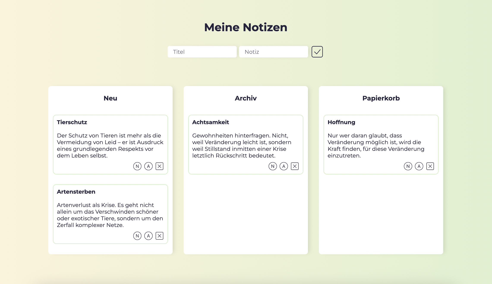

<h1 align="left">Notizblock</h1>

###

This repository contains a notepad in which texts can be assigned to different categories with different priorities. Notes can be added or deleted completely. LocalStorage was used for the first time in this project.   

This project is part of the Developer Akademie's software developer training program to learn more about JavaScript. I developed the design for this notepad, ensuring that it met the technical and logical requirements set out by the Developer Akademie. 

 

###

